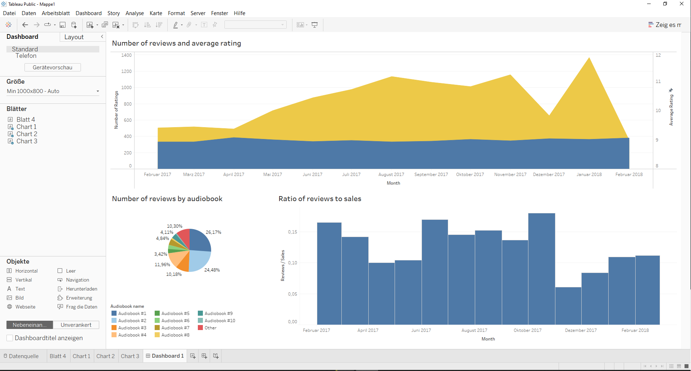

# Data Visualization with Tableau

## References
- [Youtube: Tableau for Data Science and Data Visualization - Crash Course Tutorial](https://www.youtube.com/watch?v=TPMlZxRRaBQ)
- [Youtube: Tableau in Two Minutes - Tableau Basics for Beginners](https://www.youtube.com/watch?v=jEgVto5QME8)
- [Youtube: Tableau Full Course - Learn Tableau in 6 Hours | Tableau Training for Beginners | Edureka](https://www.youtube.com/watch?v=aHaOIvR00So)
- [Youtube: How to Install Tableau and Create First Visualization | Tableau Tutorials for Beginners](https://www.youtube.com/watch?v=6xv1KvCMF1Q)

## udemy-tableau-fundamentals-of-data-visualization

This project contains data for processing and visualization using [Tableau Public on Windows](https://public.tableau.com/en-us/s/download). 
The content origins from the Udemy course [Fundamentals of Data Visualization in Tableau](https://www.udemy.com/course/fundamentals-of-data-visualization-in-tableau/).

In the context of the course the basic usage and functionalities of Tableau Public are introduced. 

<em>Tableau Dashboard</em>

## Course Chapters
- [x] Introduction to Tableau: Connecting data in Tableau, exploring Tableau's interface
- [x] Tableau Functionalities: Duplicate sheets, create tables, create custom fields, inserting filters, working with joins
- [x] The Tableau Exercise: create a dashboard, perform numbers check, blending data, create charts, add interactive filters

## Installation
1. Go to [Tableau Public on Windows](https://public.tableau.com/en-us/s/download).
2. Download executable installer file for windows (or whatever OS you have).
3. After download install Tableau Public by executing the downloaded file. 

## Keywords
* Tableau Public
* Data Visualization
* Data Preparation
* Data Science
* Statistics

## OS / Tools / Libraries Used
* Windows 10
* Tableau Public

## Conclusion / Remarks
* This course introduces the tool Tableau Public. 
* In this course the basic functionalities and basic usage of tableau are shown in terms of data manipulation and especially data visualization. 
